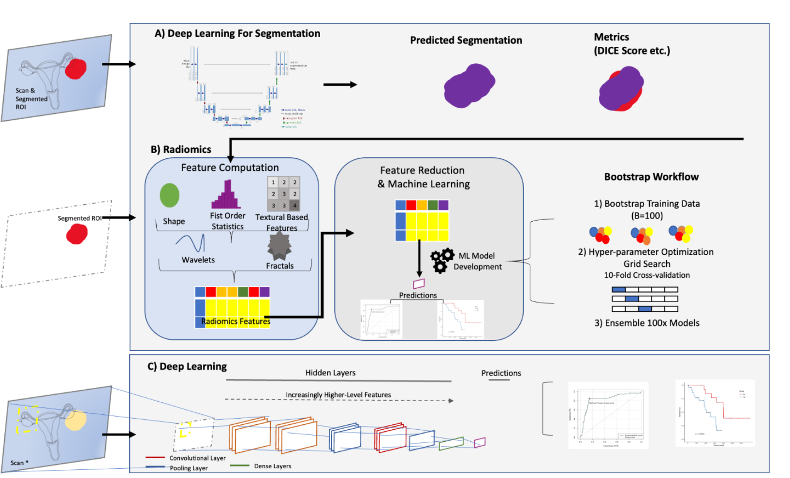

# hgsoc prognosis CT-radiomics

This repository contains the code and resources for the machine learning study focused on the segmentation and classification of primary high-grade serous ovarian cancer (HGSOC) masses using CT imaging. Our study proposes an end-to-end machine learning approach aimed at automating the overall survival prediction of HGSOC patients from primary ovarian cancer masses. As featured in the paper: "End-to-End Integrative Segmentation and Radiomics Prognostic Models Improve Risk Stratification of High-Grade Serous Ovarian Cancer: A Retrospective Multi-Cohort Study"

## Abstract
**Background** Valid stratification factors for patients with epithelial ovarian cancer (EOC) are still lacking and individualisation of care remains an unmet need. Radiomics from routine Contrast Enhanced Computed Tomography (CE-CT) is an emerging, highly promising approach towards more accurate prognostic models for the better preoperative stratification of the subset of patients with high-grade-serous histology (HGSOC). However, requirements of fine manual segmentation limit its use. We developed an end-to-end model that automates segmentation processes and prognostic evaluation algorithms in HGSOC to enable its broader implementation.

**Methods** We retrospectively collected and segmented 607 CE-CT scans across Europe and United States. The development cohort comprised of patients from Hammersmith Hospital (HH) (n=211), which was split with a ratio of 7:3 for training and validation. Data from The Cancer Imagine Archive (TCIA) (United States, n=73) and Kliniken Essen-Mitte (KEM) (Germany, n=323) were used as test sets. We developed an automated segmentation model for primary ovarian cancer lesions in CE-CT scans with U-Net based architectures. Radiomics data were computed from the CE-CT scans. For overall survival (OS) prediction, combinations of 13 feature reduction methods and 12 machine learning algorithms were developed on the radiomics data and compared with convolutional neural network models trained on CE-CT scans. In addition, we compared our model with a published radiomics model for HGSOC prognosis, the radiomics prognostic vector. In the HH and TCIA cohorts, additional histological diagnosis, transcriptomics, proteomics, and copy number alterations were collected; and correlations with the best performing OS model were identified. Predicated probabilities of the best performing OS model were dichotomised using k-means clustering to define high and low risk groups.

**Findings** Using the combination of segmentation and radiomics as an end-to-end framework, the prognostic model improved risk stratification of HGSOC over CA-125, residual disease, FIGO staging and the previously reported radiomics prognostic vector. Calculated from predicted and manual segmentations, our automated segmentation model achieves dice scores of 0.90, 0.88, 0.80 for the HH validation, TCIA test and KEM test sets, respectively. The top performing radiomics model of OS achieved a Concordance index (C-index) of 0.66 ± 0.06 (HH validation) 0.72 ± 0.05 (TCIA), and 0.60 ± 0.01 (KEM). In a multivariable model of this radiomics model with age, residual disease, and stage, the C-index values were 0.71 ± 0.06, 0.73 ± 0.06, 0.73 ± 0.03 for the HH validation, TCIA and KEM datasets, respectively. High risk groups were associated with poor prognosis (OS) the Hazard Ratios (CI) were 4.81 (1.61-14.35), 6.34 (2.08-19.34), and 1.71 (1.10 - 2.65) after adjusting for stage, age, performance status and residual disease. We show that these risk groups are associated with and invasive phenotype involving soluble N-ethylmaleimide sensitive fusion protein attachment receptor (SNARE) interactions in vesicular transport and activation of Mitogen-Activated Protein Kinase (MAPK) pathways.

## Features
Segmentation Model and Code
Overall Survival Model and Code
Radiomics Model Code

## Getting Started 

To start the segmentation model in this project, you'll need to set up a Python environment and install the necessary dependencies for nn-Unet (Version 2.2). We recommend using Conda to manage your environment. If you don't have Conda installed, you can download it from the Anaconda or Miniconda websites. 

To start with the "renv.lock" file to load the R environment and run according to the example provided. 

 ## Data availability

The anonymized CT image datasets and corresponding clinical metadata used for model development and validation in this study are not publicly available due to privacy and ethical considerations. However, these datasets can be made accessible to qualified researchers upon reasonable request to the corresponding author; any specific accession codes or unique identifiers associated with the datasets will be provided upon approval of the request. 
